# Your Journey to 1000 TPS on Mojaloop

> **The Challenge**: You need to prove Mojaloop can handle 1000 transactions per second with full security enabled and 8 DFSPs.
> 
> **The Solution**: This guide takes you through a proven, reproducible path to achieve and validate 1000 TPS performance.
> 
> **Time Investment**: 2-3 days for full deployment and testing

## 🗺️ The Journey Map

```plantuml
@startuml
!theme plain
skinparam backgroundColor #FEFEFE
skinparam shadowing false
skinparam defaultFontName Arial
skinparam defaultFontSize 14
skinparam roundcorner 15

skinparam activity {
  BackgroundColor #e3f2fd
  BorderColor #1976d2
  BorderThickness 2
  FontColor #0d47a1
  FontStyle bold
  BarColor #1976d2
}

skinparam activityDiamond {
  BackgroundColor #fff9c4
  BorderColor #f57f17
  BorderThickness 2
  FontColor #f57f17
}

title = Your Journey to 1000 TPS on Mojaloop
header = Total Time: 2-3 days | Active Time: 8-10 hours

|#e1f5fe|= **Prerequisites** |
start
:🏁 **Start Here**
30 minutes;
note right
  * Verify AWS access
  * Check service limits
  * Install tools
  * Understand costs
end note

|#fff3e0|= **Infrastructure** |
:🏗️ **Build AWS Foundation**
2-3 hours;
note right
  * Create VPCs
  * Deploy 2 EKS clusters
  * Set up RDS & Redis
  * Configure networking
end note

|#f3e5f5|= **Platform** |
:☸️ **Deploy Kubernetes**
1-2 hours;
note right
  * Install platform services
  * Configure Istio mesh
  * Set up cert-manager
  * Deploy ArgoCD
end note

|#e8f5e9|= **Application** |
:💰 **Install Mojaloop**
2-3 hours;
note right
  * Deploy core services
  * Configure 8 DFSPs
  * Enable security stack
  * Verify health
end note

|#fff9c4|= **Testing Setup** |
:🚀 **K6 Infrastructure**
1-2 hours;
note right
  * Separate K6 cluster
  * Deploy operators
  * Configure workers
  * Test connectivity
end note

|#ffebee|= **Validation** |
if (First Test Pass?) then (yes)
  |#ffebee|= **Performance** |
  :📊 **Run Full Tests**
  4-6 hours;
  note right
    * Baseline: 100 TPS
    * Scale: 500 TPS
    * Target: 1000 TPS
    * Stress: Find limits
  end note
else (no)
  :🔧 **Troubleshoot**;
  note right
    * Check logs
    * Verify connectivity
    * Review configuration
  end note
  stop
endif

if (Achieved 1000 TPS?) then (no)
  :🔄 **Performance Tuning**;
  note right
    * Follow TUNING-PLAYBOOK.md
    * Scale infrastructure (Phase 02)
    * Tune Mojaloop (Phase 04)
    * Re-run tests (Phase 07)
    * Typically 2-3 iterations
  end note
  -> Iterate;
else (yes)
  -> Continue;
endif

|#e0f2f1|= **Results** |
:📈 **Analyze & Report**
1-2 hours;
note right
  * Generate reports
  * Create dashboards
  * Document findings
  * Share insights
end note

stop

legend right
  |= Color |= Phase |= Focus |
  |<#e1f5fe> | Prerequisites | Preparation |
  |<#fff3e0> | Infrastructure | AWS Resources |
  |<#f3e5f5> | Platform | Kubernetes |
  |<#e8f5e9> | Application | Mojaloop |
  |<#fff9c4> | Testing | K6 Setup |
  |<#ffebee> | Performance | Load Tests |
  |<#e0f2f1> | Analysis | Results |
endlegend

@enduml
```



## 🎯 What You'll Achieve

By the end of this journey, you'll have:
- ✅ Production-grade Mojaloop running on AWS EKS
- ✅ 8 DFSPs with full security stack (mTLS, JWS, ILP)
- ✅ Isolated K6 infrastructure generating 1000+ TPS
- ✅ Real-time monitoring with Grafana dashboards
- ✅ Reproducible test results and analysis

## 📋 Before You Begin

<details>
<summary><strong>Required Access & Tools</strong> (click to expand)</summary>

### AWS Access
- [ ] AWS Account with admin privileges
- [ ] Budget approval for ~$500/day infrastructure costs
- [ ] Service limits increased (see [Phase 01](phases/01-prerequisites/))

### Local Tools
```bash
# Check if you have these installed
aws --version          # AWS CLI 2.x
terraform --version    # Terraform 1.5+
kubectl version        # Kubernetes CLI 1.27+
helm version          # Helm 3.12+
jq --version          # jq 1.6+
```

### Time & Resources
- **Active Time**: 8-10 hours
- **Total Duration**: 2-3 days (including wait times)
- **Team Size**: 1-2 people recommended

</details>

## 🚦 Choose Your Path

### 🏃 Quick Path: "I just need results"
```bash
# Automated deployment with defaults
./phases/run-all.sh --quick
```
→ Go to [Phase 06 - First Test](phases/06-first-test/)

### 🎓 Learning Path: "I want to understand everything"
Start with [Phase 01](phases/01-prerequisites/) and follow each phase sequentially.

### 🔧 Custom Path: "I have existing infrastructure"
Jump to the relevant phase:
- Already have AWS? → [Phase 03 - Kubernetes](phases/03-kubernetes/)
- Have K8s cluster? → [Phase 04 - Mojaloop](phases/04-mojaloop/)
- Mojaloop running? → [Phase 05 - K6 Setup](phases/05-k6-infrastructure/)

## 📊 Success Metrics

Throughout your journey, these are the key metrics that indicate success:

| Phase | Success Indicator | Target Value |
|-------|------------------|--------------|
| Infrastructure | EKS Clusters Active | 2 clusters |
| Kubernetes | All Pods Running | 100% healthy |
| Mojaloop | Services Responding | < 50ms ping |
| K6 Infrastructure | Workers Ready | 5-8 nodes |
| Performance Test | Transactions/sec | 1000+ TPS |
| Analysis | Success Rate | > 99.5% |

## 🚨 Common Pitfalls (and How to Avoid Them)

<details>
<summary><strong>🔴 AWS Service Limits</strong></summary>

**Problem**: Default AWS limits prevent creating required resources.

**Solution**: Request limit increases before starting:
```bash
# Check current limits
./phases/01-prerequisites/check-aws-limits.sh

# Request increases if needed (takes 24-48 hours)
./phases/01-prerequisites/request-limit-increases.sh
```
</details>

<details>
<summary><strong>🔴 K6 on Same Cluster</strong></summary>

**Problem**: Running K6 on Mojaloop cluster skews performance metrics.

**Solution**: Always use separate K6 infrastructure:
```bash
# Verify K6 is on separate cluster
kubectl config use-context k6-cluster
kubectl get nodes
```
</details>

<details>
<summary><strong>🔴 Security Stack Disabled</strong></summary>

**Problem**: Testing without mTLS/JWS doesn't reflect production performance.

**Solution**: Ensure security is enabled:
```bash
# Verify security stack
./phases/04-mojaloop/verify-security.sh
```
</details>

## 📚 Phase Details

### [Phase 01: Prerequisites & Planning](phases/01-prerequisites/)
*30 minutes* - Verify access, tools, and AWS limits

### [Phase 02: AWS Infrastructure](phases/02-infrastructure/)
*2-3 hours* - Provision VPCs, EKS clusters, and supporting services

### [Phase 03: Kubernetes Platform](phases/03-kubernetes/)
*1-2 hours* - Deploy platform services and configure networking

### [Phase 04: Mojaloop Deployment](phases/04-mojaloop/)
*2-3 hours* - Install Mojaloop with 8 DFSPs and security stack

### [Phase 05: K6 Infrastructure](phases/05-k6-infrastructure/)
*1-2 hours* - Set up isolated load testing infrastructure

### [Phase 06: First Test Run](phases/06-first-test/)
*30 minutes* - Validate setup with a small test

### [Phase 07: Performance Testing](phases/07-performance-tests/)
*4-6 hours* - Execute full test suite up to 1000 TPS

### [Phase 08: Analysis & Reporting](phases/08-analysis/)
*1-2 hours* - Analyze results and generate reports

## 💡 Getting Help

### Real-Time Support
- 🔍 Each phase has a `TROUBLESHOOTING.md` file
- 💬 Search issues in this repo for common problems
- 📊 Check Grafana dashboards for system health

### Quick Diagnostics
```bash
# Run from any phase directory
./validate.sh              # Check current phase status
./troubleshoot.sh          # Diagnose common issues
./rollback.sh             # Safely rollback changes
```

## 🎉 What's Next?

After achieving 1000 TPS:
1. **Run Variations**: Test different transaction patterns
2. **Optimize Further**: Use analysis to improve performance
3. **Share Results**: Contribute your findings back
4. **Production Planning**: Apply learnings to your deployment

---

> **Remember**: This isn't just about hitting a number. It's about understanding how Mojaloop performs under load and building confidence in your production deployment.

Ready? Let's begin with [Phase 01: Prerequisites & Planning](phases/01-prerequisites/) →