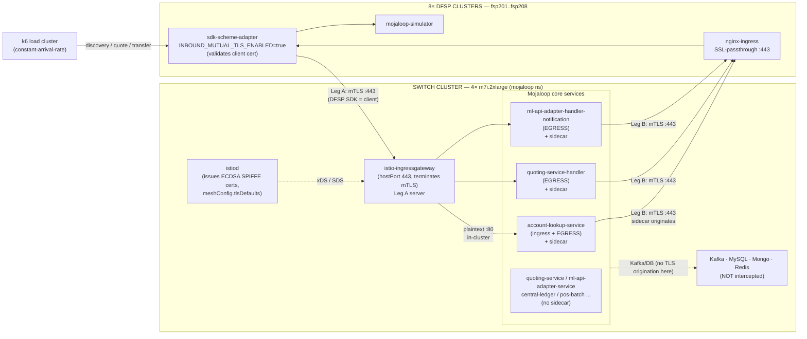
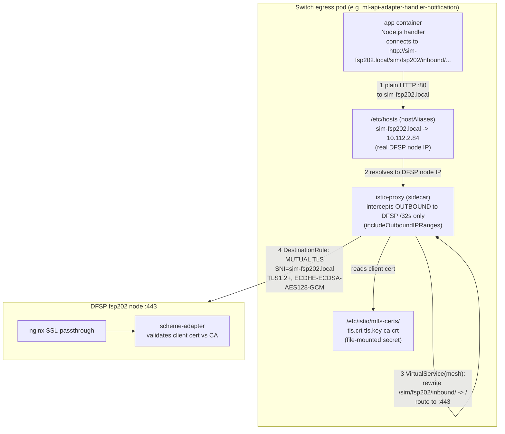
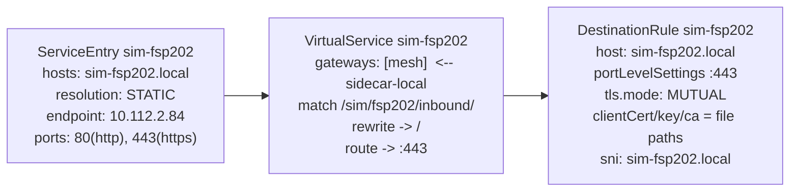
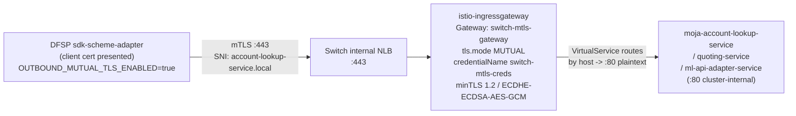
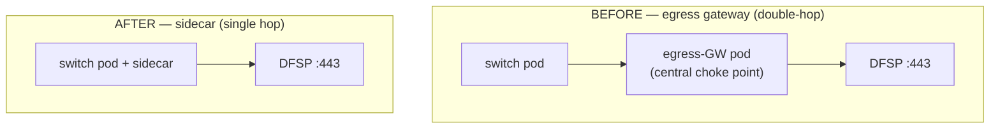
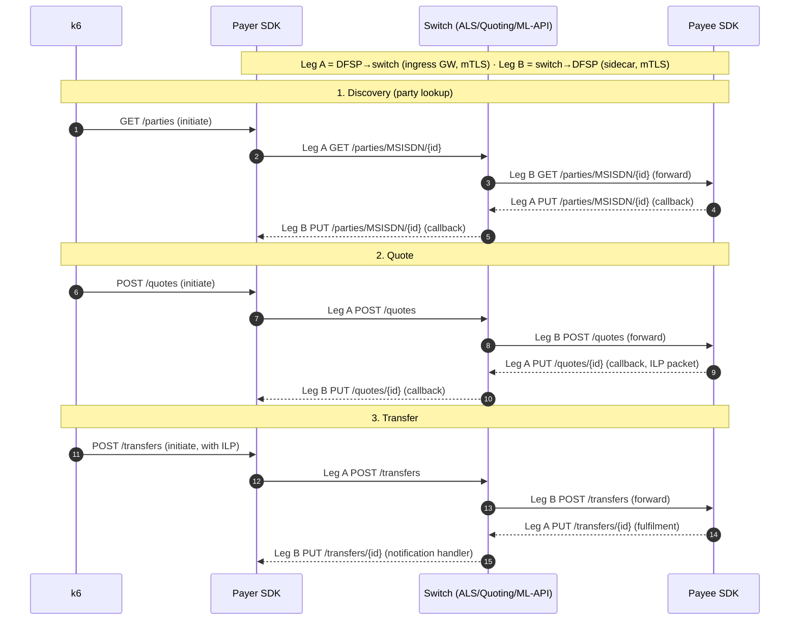

# Mojaloop Switch ⇄ DFSP mTLS — Sidecar Architecture

**Audience:** platform / SRE / security team.
**Scope:** how end-to-end mutual TLS is wired between the Mojaloop switch and the 8 DFSP
simulators using **Istio sidecar** TLS origination (not the egress gateway).
**Result it delivers:** 500 TPS with full mTLS at e2e p99 = 778 ms on a 4×8 vCPU cluster.
See [500tps-mtls-sidecar-result.md](500tps-mtls-sidecar-result.md) for the benchmark data.

> **One-line summary:** every switch→DFSP call has mTLS originated by the **calling pod's own
> Envoy sidecar** (scoped to the 8 DFSP IPs, client cert file-mounted); every DFSP→switch call
> has mTLS terminated by the shared **Istio ingress gateway**. There is **no central egress
> gateway** — that double-hop was the bottleneck we removed.

---

## 1. The two legs (terminology used throughout)

| Leg | Direction | What flows | mTLS endpoint on the switch |
|-----|-----------|-----------|------------------------------|
| **Leg A** | DFSP → switch | `GET /parties`, `POST /quotes`, `POST /transfers` | **Ingress gateway** terminates (server) |
| **Leg B** | switch → DFSP | callbacks: `PUT /parties`, `PUT /quotes`, `PUT /transfers` | **Per-pod sidecar** originates (client) |

Both legs use the **same shared ECDSA P-256 cert bundle** (lab simplification — see §7).

---

## 2. High-level topology



**Key facts encoded above**
- Only **3 deployments** get a sidecar — the ones that make outbound DFSP callbacks
  (account-lookup-service, quoting-service-handler, ml-api-adapter-handler-notification).
- All other mojaloop pods and **all infra (Kafka/MySQL/Mongo/Redis) are NOT in the mesh** —
  their traffic is never intercepted (this keeps sidecar overhead off the hot path).
- The DFSP terminates mTLS at **nginx SSL-passthrough → scheme-adapter**, which *requires* a
  valid client cert (`INBOUND_MUTUAL_TLS_ENABLED=true`).

---

## 3. Leg B — the sidecar mTLS path (the important one)

This is what changed. Each callback is originated by the **calling pod's own istio-proxy**,
not a shared gateway.



### Istio objects that make Leg B work (per FSP, ×8)



### Pod-level wiring (how the sidecar gets injected + the cert)

The role patches each of the 3 deployments with:

```yaml
spec:
  template:
    metadata:
      labels:
        sidecar.istio.io/inject: "true"            # object-selector injection (ns stays unlabeled)
      annotations:
        traffic.sidecar.istio.io/includeOutboundIPRanges: "10.112.2.84/32,...(8 DFSPs)"
        sidecar.istio.io/userVolume:      '[{"name":"mtls-certs","secret":{"secretName":"switch-mtls-creds"}}]'
        sidecar.istio.io/userVolumeMount: '[{"name":"mtls-certs","mountPath":"/etc/istio/mtls-certs","readOnly":true}]'
        proxy.istio.io/config: '{"holdApplicationUntilProxyStarts":true}'
        # handlers only (egress-only): traffic.sidecar.istio.io/includeInboundPorts: ""
    spec:
      hostAliases:                                  # sim-fspNNN.local -> real DFSP node IP
        - { ip: 10.112.2.84, hostnames: [sim-fsp202.local] }   # ...x8
```

> **Why file-mounted certs, not `credentialName`?** A sidecar's SDS does **not** load a
> DestinationRule `credentialName` secret — only gateways do. So the cert is mounted into the
> istio-proxy container and the DR references file paths.

> **Why scope `includeOutboundIPRanges`?** So the sidecar intercepts **only** the 8 DFSP IPs.
> Kafka, MySQL, Mongo, Redis, and in-cluster service traffic bypass Envoy entirely — zero
> added latency or CPU on the hot path.

---

## 4. Leg A — inbound (DFSP → switch), terminated at the ingress gateway



- The gateway validates the DFSP client cert against the shared CA in `switch-mtls-creds`.
- After termination, traffic is plain HTTP **inside** the switch cluster (the mesh boundary is
  the gateway / the sidecar, not every hop).
- **ALS is dual-role:** it both receives Leg A (ingress) and originates Leg B (egress). That is
  why ALS keeps inbound interception on its sidecar, while the two pure Kafka-consumer handlers
  set `includeInboundPorts: ""`.

---

## 5. Why sidecar, not egress gateway — the design rationale



The egress gateway forced every callback through an extra in-cluster pod-to-pod hop (often
cross-node). That doubled the packets the kernel's iptables/Calico dataplane had to process,
which showed up as **softirq** and saturated the hot node:

| Metric (500 TPS) | no-mTLS | mTLS egress-GW | **mTLS sidecar** |
|---|---|---|---|
| Result | ✅ 499.99 TPS | ❌ 364.6 TPS, 22.6 s p99 | ✅ **499.997 TPS, 778 ms p99** |
| **Softirq (cores)** | 2.52 | **8.93** | **3.31** |
| Hottest node CPU | 70% | 99% (cascade) | 86% |
| Network (MB/s) | 191 | 348 | 171 |
| Egress-GW Envoy CPU | 0.01 | 1.02 | **0.01 (retired)** |

Sidecars put mTLS at the pod boundary, collapse Leg B back to a single hop, and distribute the
Envoy CPU across the calling pods instead of one gateway. mTLS overhead drops from ~12 cores to
~2 cores. **The crypto was never the cost — the gateway hop was.**

---

## 6. Crypto / TLS parameters

| Layer | Setting | Value | Where |
|---|---|---|---|
| Identity cert | Algorithm | **ECDSA P-256**, SHA-256 | `certs/regen-certs.sh` |
| Identity cert | Usage | CA: keyCertSign,cRLSign · leaf: digitalSignature, serverAuth+clientAuth | `regen-certs.sh` |
| Leg A (server) | TLS floor / ciphers | min **TLS 1.2**, 1.3 negotiated; `ECDHE-ECDSA-AES128/256-GCM` | `manifests/mtls/switch-inbound.yaml` (Gateway) |
| Leg B (client) | TLS floor / ciphers | same, set **mesh-wide** (DR can't carry cipher fields) | `common/istiod-values.yaml` → `meshConfig.tlsDefaults` |
| Key exchange | ECDH curves | **X25519**, then P-256 | `meshConfig.tlsDefaults` |
| In-mesh certs | istiod workload certs | **ECDSA** (`ECC_SIGNATURE_ALGORITHM`) | `common/istiod-values.yaml` |
| Bulk cipher | AEAD under TLS 1.3 | AES-128-GCM (AES-NI; fixed in BoringSSL) | automatic |

> AES-128-GCM is the steady-state cost (per-byte) and is hardware-accelerated on the m7i/c7i
> nodes. The cert curve only matters at handshake time, which is amortized to near-zero by
> HTTP/1.1 keepalive (~4,800 requests/connection observed).

---

## 7. Production caveats (call these out when sharing)

- **Single shared key + cert** across the CA, the switch, and all 8 DFSPs. Lab simplification.
  Production wants **per-FSP identities** (or istiod-issued SPIFFE) under an intermediate CA, so
  one key compromise ≠ whole-mesh compromise, and rotation/revocation is per-party.
- **mTLS rotation is a two-cluster operation:** the switch secret (`switch-mtls-creds`) and the
  DFSP secret (`mtls-shared-creds`) are applied by *different* playbooks. Rotating means pushing
  the new bundle to **both** sides + restarting the switch egress pods (file-mounted certs don't
  hot-reload like the gateway's SDS) and the DFSP scheme-adapters.
- **Not pinned to TLS 1.3-only** on purpose — the DFSP scheme-adapter's TLS floor isn't verified
  to support 1.3, and a 1.3-only *client* floor would break Leg B. 1.2 floor + 1.3-preferred is
  the interop-safe posture.

---

## 8. Component / file reference

| Component | Identity | Source |
|---|---|---|
| Leg A Gateway + VS | `switch-mtls-gateway` (istio-system) | `manifests/mtls/switch-inbound.yaml` |
| Leg B SE/VS/DR (×8) | `sim-fspNNN` (mojaloop) | rendered from `roles/mtls_switch/templates/switch-outbound-sidecar.yaml.j2` |
| Sidecar injection + cert mount + hostAliases | 3 egress deployments | `roles/mtls_switch/tasks/main.yml` |
| istiod ECDSA + TLS defaults | istiod | `common/istiod-values.yaml` |
| Shared cert bundle | `switch-mtls-creds` / `mtls-shared-creds` | `certs/regen-certs.sh` |
| DFSP-side mTLS enable | scheme-adapter env | `roles/dfsp/tasks/per_fsp.yml` |
| Deploy command | `make mtls SCENARIO=500tps` | `ansible/playbooks/mtls-switch.yml` |

---

### Appendix — per-transaction call flow (FSPIOP lifecycle)

Each FSPIOP phase is **asynchronous**: the switch forwards the request to the payee, the payee
callbacks the switch, and the switch callbacks the payer. So every phase crosses **Leg A twice**
(payer→switch, payee→switch) and **Leg B twice** (switch→payee, switch→payer).



> Solid arrows = requests, dashed = async callbacks. The mTLS leg is set by **direction**, not by
> role: any DFSP→switch hop is Leg A (ingress GW terminates), any switch→DFSP hop is Leg B
> (sidecar originates) — so both the payer and the payee sit behind both legs.
