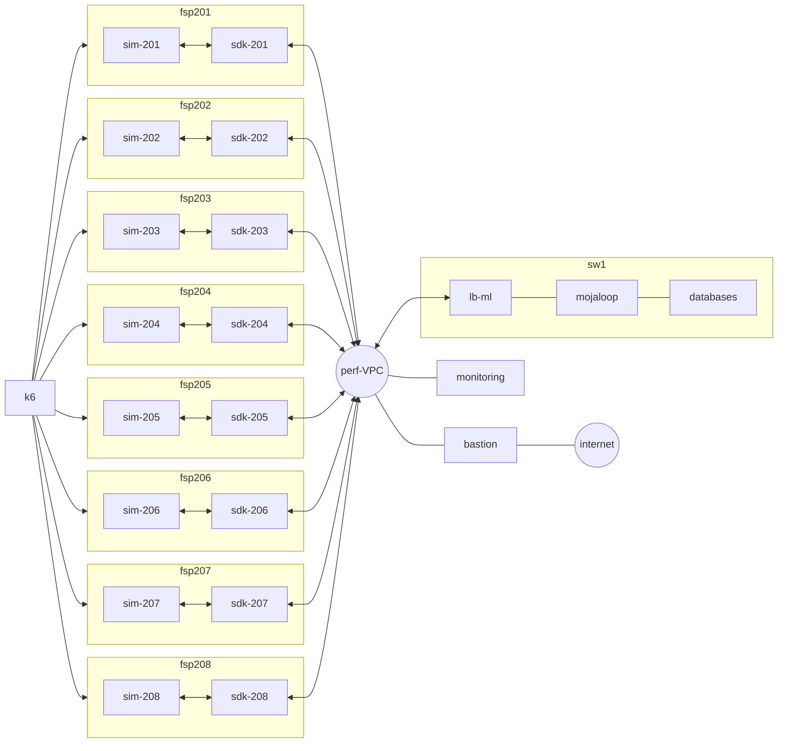

# Infrastructure Architecture

```mermaid
graph LR

  perf-vpc((perf-VPC))

  subgraph fsp201
    sim-201 <--> sdk-201
  end

  subgraph fsp202
    sim-202 <--> sdk-202
  end

  subgraph fsp203
    sim-203 <--> sdk-203
  end

  subgraph fsp204
    sim-204 <--> sdk-204
  end

  subgraph fsp205
    sim-205 <--> sdk-205
  end

  subgraph fsp206
    sim-206 <--> sdk-206
  end

  subgraph fsp207
    sim-207 <--> sdk-207
  end

  subgraph fsp208
    sim-208 <--> sdk-208
  end

  subgraph sw1
    lb-ml --- mojaloop --- databases
  end

  sdk-201 <--> perf-vpc
  sdk-202 <--> perf-vpc
  sdk-203 <--> perf-vpc
  sdk-204 <--> perf-vpc
  sdk-205 <--> perf-vpc
  sdk-206 <--> perf-vpc
  sdk-207 <--> perf-vpc
  sdk-208 <--> perf-vpc

  perf-vpc <--> lb-ml

  perf-vpc --- monitoring

  perf-vpc --- bastion --- internet((internet))

  k6 --> fsp201
  k6 --> fsp202
  k6 --> fsp203
  k6 --> fsp204
  k6 --> fsp205
  k6 --> fsp206
  k6 --> fsp207
  k6 --> fsp208 

```