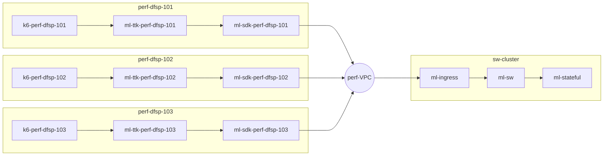

# Infrastructure high level architecture

## 1. Overview

```mermaid
graph LR
  perf-vpc((perf-VPC))
  subgraph sw-cluster
    ml-ingress --> ml-sw --> ml-stateful
  end

  subgraph perf-dfsp-101
    k6-perf-dfsp-101 ---> ml-ttk-perf-dfsp-101 ---> ml-sdk-perf-dfsp-101
  end
  ml-sdk-perf-dfsp-101 ---> perf-vpc

  subgraph perf-dfsp-102
    k6-perf-dfsp-102 ---> ml-ttk-perf-dfsp-102 ---> ml-sdk-perf-dfsp-102
  end
  ml-sdk-perf-dfsp-102 ---> perf-vpc

  subgraph perf-dfsp-103
    k6-perf-dfsp-103 ---> ml-ttk-perf-dfsp-103 ---> ml-sdk-perf-dfsp-103
  end
  ml-sdk-perf-dfsp-103 ---> perf-vpc
   

   
  perf-vpc ---> ml-ingress

```