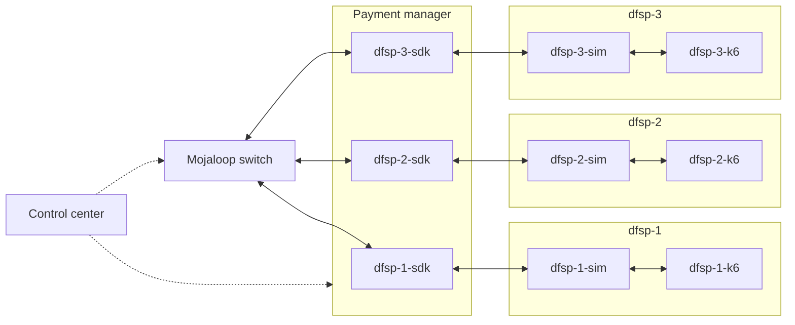

# Infrastructure high level architecture

## 1. verview

The infrastructure reproduces a real worl design of a Mojaloop implemenation. 

The control center provide the Gitops environment to deploy, modify, destroy the mojaloop switch and the payment manager. The control center is not directly involved in transactions.

The Mojaloop switch is deployed from the control center in its dedicated infrastructure

The mayment manager is deployed from the control center on its dedicated infrastructure. The same payment manager provide distinct namespace for each DFSP SDK resources.

Each DFSP resources including the core banking simulator and the K6 are deployed in the payment manager cluster in a dedeicated namespace

## 2. Control center

## 3. Mojaloop switch

### 3.1. HLD

|      Layer           |     Components       |
|----------------------|----------------------|
| Applications| Mojaloop, MCM, finance portal ....
| Plateform| argocd, gitlab
| K8s-cluster| provider: microk8s   each node runs both a control plan and worker
| VMs| OS: Ubuntu 24.04LTS   size: m5.4xlarge   Count: 3
| Infrastructure|  AWS

### 3.2. Main components
The switch environement have below components:
- Mojaloop switch
- Finance portal
- MCM
- Stateful resources: Mysql, Mongodb, Kafka, Redis
- Monitoring stack: Grafana, prometheus, Loki
- Other tools: Vault, Keycloak, ory, external-dns, certmanager, minio, valero, longhorn
- ISTIO

## 4. Payment manager

### 4.1 HLD

|      Layer           |     Components       |
|----------------------|----------------------|
| Applications| PM$ML, dfsp-*-sim ....
| Plateform| argocd, gitlab
| K8s-cluster| provider: microk8s   each node runs both a control plan and worker
| VMs| OS: Ubuntu 24.04LTS   size: m5.4xlarge   Count: 3
| Infrastructure|  AWS

## DFSP simulator