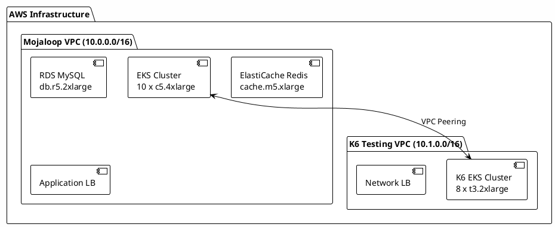

# Phase 02: AWS Infrastructure

> **Purpose**: Build the foundation - VPCs, EKS clusters, and supporting AWS services
> 
> **Time Required**: 2-3 hours
> 
> **Outcome**: Two EKS clusters ready for Mojaloop and K6 deployments

## 🎯 What You'll Build



## 📋 Pre-flight Checks

```bash
# Verify prerequisites completed
../01-prerequisites/validate-prerequisites.sh

# Check AWS access
aws sts get-caller-identity

# Verify service limits
./check-limits.sh
```

## 🚀 Deploy Infrastructure

### Option 1: Automated Deployment (Recommended)

```bash
# Deploy everything with defaults
./scripts/deploy.sh --auto-approve

# Monitor progress (in another terminal)
./scripts/monitor-deployment.sh
```

### Option 2: Step-by-Step Deployment

<details>
<summary><strong>Manual Steps for Learning</strong></summary>

```bash
# 1. Initialize all Terraform modules
cd terraform
terraform init -backend-config=backend.conf

# 2. Review what will be created
terraform plan -out=tfplan

# 3. Apply infrastructure
terraform apply tfplan

# 4. Save outputs for next phases
terraform output -json > outputs.json
cp outputs.json ../../shared-state/infrastructure-outputs.json
```

</details>

## 📊 Deployment Progress

The deployment creates resources in this order:

1. **Networking** (10 minutes)
   - VPCs and subnets
   - Internet/NAT gateways
   - VPC peering connection

2. **Security** (5 minutes)
   - Security groups
   - IAM roles and policies
   - KMS keys

3. **EKS Clusters** (15-20 minutes each)
   - Control planes
   - Node groups
   - Add-ons (CoreDNS, kube-proxy)

4. **Data Services** (10 minutes)
   - RDS MySQL instance
   - ElastiCache Redis cluster
   - S3 buckets

## 🔍 Validation

After deployment completes:

```bash
# Run validation script
./validate.sh

# Expected output:
Infrastructure Validation
========================
✅ Mojaloop VPC: Created (vpc-0abc123)
✅ K6 VPC: Created (vpc-0def456)
✅ VPC Peering: Active
✅ Mojaloop EKS: Active (15 nodes ready)
✅ K6 EKS: Active (8 nodes ready)
✅ RDS Instance: Available
✅ ElastiCache: Available
✅ Load Balancers: Active

🎉 Infrastructure ready!
```

## 🔧 Troubleshooting

<details>
<summary><strong>EKS cluster creation stuck</strong></summary>

```bash
# Check CloudFormation stacks
aws cloudformation list-stacks --stack-status-filter CREATE_IN_PROGRESS

# View EKS cluster status
aws eks describe-cluster --name mojaloop-cluster

# Common fix: Delete and recreate
./rollback.sh --cluster-only
./deploy.sh --cluster-only
```

</details>

<details>
<summary><strong>Insufficient capacity error</strong></summary>

```bash
# Try different availability zones
./deploy.sh --az us-west-2a,us-west-2b

# Or use different instance types
./deploy.sh --instance-type c5.2xlarge --count 20
```

</details>

## 💾 State Management

Your infrastructure state is stored in:
- Local: `terraform/terraform.tfstate`
- Backup: `terraform/terraform.tfstate.backup`

**Important**: Back up these files!

```bash
# Create backup
./backup-state.sh

# Restore from backup
./restore-state.sh --from backups/tfstate-20240120.tar.gz
```

## 📤 Outputs

Key outputs saved to `outputs.json`:

```json
{
  "mojaloop_cluster_endpoint": "https://xxx.eks.amazonaws.com",
  "mojaloop_cluster_name": "mojaloop-perf",
  "k6_cluster_endpoint": "https://yyy.eks.amazonaws.com",
  "k6_cluster_name": "k6-perf",
  "rds_endpoint": "mojaloop.xxx.rds.amazonaws.com",
  "redis_endpoint": "mojaloop.xxx.cache.amazonaws.com"
}
```

## ✅ Completion Checklist

- [ ] All Terraform resources created successfully
- [ ] Both EKS clusters accessible via kubectl
- [ ] VPC peering connection active
- [ ] RDS and ElastiCache instances running
- [ ] Outputs saved for next phase

## 🚀 Next Step

Configure kubectl for both clusters:

```bash
# Get cluster credentials
aws eks update-kubeconfig --name mojaloop-perf --alias mojaloop
aws eks update-kubeconfig --name k6-perf --alias k6

# Verify access
kubectl config use-context mojaloop
kubectl get nodes

kubectl config use-context k6
kubectl get nodes
```

Ready? → [Phase 03: Kubernetes Platform](../03-kubernetes/)

---

<details>
<summary><strong>📚 Additional Resources</strong></summary>

- [Terraform Configuration Details](terraform/README.md)
- [Network Architecture](NETWORK.md)
- [Security Considerations](SECURITY.md)
- [Cost Optimization](COST_OPTIMIZATION.md)

</details>