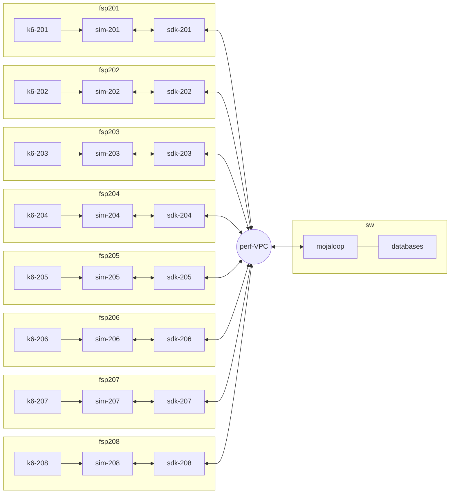

```mermaid
graph LR

  perf-vpc((perf-VPC))

  subgraph fsp201
    k6-201 --> sim-201 <--> sdk-201
  end

  subgraph fsp202
    k6-202 --> sim-202 <--> sdk-202
  end

  subgraph fsp203
    k6-203 --> sim-203 <--> sdk-203
  end

  subgraph fsp204
    k6-204 --> sim-204 <--> sdk-204
  end

  subgraph fsp205
    k6-205 --> sim-205 <--> sdk-205
  end

  subgraph fsp206
    k6-206 --> sim-206 <--> sdk-206
  end

  subgraph fsp207
    k6-207 --> sim-207 <--> sdk-207
  end

  subgraph fsp208
    k6-208 --> sim-208 <--> sdk-208
  end

  subgraph sw
    mojaloop --- databases
  end

  sdk-201 <--> perf-vpc
  sdk-202 <--> perf-vpc
  sdk-203 <--> perf-vpc
  sdk-204 <--> perf-vpc
  sdk-205 <--> perf-vpc
  sdk-206 <--> perf-vpc
  sdk-207 <--> perf-vpc
  sdk-208 <--> perf-vpc

  perf-vpc <--> mojaloop

```