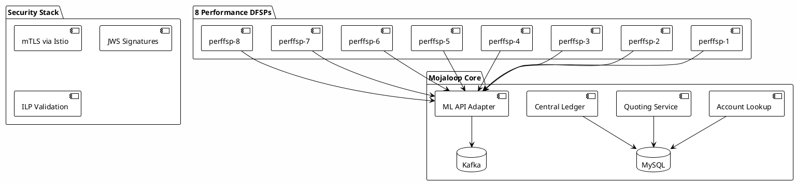
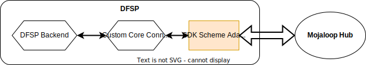

# Phase 04: Mojaloop Deployment

> **Purpose**: Deploy Mojaloop with 8 DFSPs and full security stack
> 
> **Time Required**: 2-3 hours
> 
> **Outcome**: Production-grade Mojaloop handling secure transactions between 8 DFSPs

## 🎯 What You'll Deploy



### Architecture Overview


*Complete Mojaloop architecture showing all core components, data stores, and messaging systems*

## 📋 Pre-deployment Setup

```bash
# Switch to mojaloop context
kubectl config use-context mojaloop

# Verify platform services
../03-kubernetes/validate.sh

# Create mojaloop namespace
kubectl create namespace mojaloop
kubectl label namespace mojaloop istio-injection=enabled
```

## 🚀 Deploy Mojaloop

### Quick Deployment

```bash
# Deploy with performance configuration
./deploy.sh --config performance

# Monitor deployment (new terminal)
./monitor-deployment.sh
```

### Step-by-Step Deployment

<details>
<summary><strong>Manual Deployment Steps</strong></summary>

```bash
# 1. Add Mojaloop Helm repo
helm repo add mojaloop https://mojaloop.io/helm/repo
helm repo update

# 2. Deploy core services
helm install mojaloop mojaloop/mojaloop \
  -f values-performance.yaml \
  -n mojaloop \
  --timeout 30m \
  --wait

# 3. Deploy 8 performance DFSPs
kubectl apply -f dfsp-deployments/

# 4. Enable security stack
./enable-security.sh
```

</details>

## 🏦 DFSP Configuration

### SDK-Scheme-Adapter Architecture


*How DFSPs connect to Mojaloop through the SDK-Scheme-Adapter*

### Performance Testing DFSPs

| DFSP | Type | MSISDN Range | Initial Position |
|------|------|--------------|------------------|
| perffsp-1 | Payer | 190123450XX | $1,000,000 |
| perffsp-2 | Payer | 190123451XX | $1,000,000 |
| perffsp-3 | Payer | 190123452XX | $1,000,000 |
| perffsp-4 | Payer | 190123453XX | $1,000,000 |
| perffsp-5 | Payee | 190123454XX | $0 |
| perffsp-6 | Payee | 190123455XX | $0 |
| perffsp-7 | Payee | 190123456XX | $0 |
| perffsp-8 | Payee | 190123457XX | $0 |

### Provisioning Test Data

```bash
# Provision participants and accounts
./provision-dfsp-data.sh

# Verify provisioning
./verify-participants.sh

# Expected output:
Participant Verification
=======================
✅ perffsp-1: 100 accounts provisioned
✅ perffsp-2: 100 accounts provisioned
✅ perffsp-3: 100 accounts provisioned
✅ perffsp-4: 100 accounts provisioned
✅ perffsp-5: 100 accounts provisioned
✅ perffsp-6: 100 accounts provisioned
✅ perffsp-7: 100 accounts provisioned
✅ perffsp-8: 100 accounts provisioned

Total: 800 test accounts ready
```

## 🔐 Security Stack Configuration

### mTLS (Mutual TLS)
```bash
# Verify mTLS is active
./verify-security.sh --mtls

# Check peer authentication
kubectl get peerauthentication -n mojaloop
```

### JWS Signatures
```bash
# Configure SDK scheme adapters
./configure-jws.sh

# Verify JWS is enabled
kubectl logs -n mojaloop deployment/perffsp-1-sdk-scheme-adapter | grep JWS
```

### ILP (Interledger Protocol)
```bash
# Test ILP packet generation
./test-ilp.sh --dfsp perffsp-1

# Verify condition/fulfillment
```

## 📊 Performance Tuning

Key configurations for 1000 TPS:

<details>
<summary><strong>Service Replicas & Resources</strong></summary>

```yaml
# Account Lookup Service
als:
  replicas: 10
  resources:
    requests:
      cpu: 2
      memory: 4Gi
    limits:
      cpu: 4
      memory: 8Gi

# ML API Adapter  
ml-api-adapter:
  replicas: 12
  resources:
    requests:
      cpu: 2
      memory: 4Gi
    limits:
      cpu: 4
      memory: 8Gi

# Central Ledger
central-ledger:
  replicas: 8
  resources:
    requests:
      cpu: 4
      memory: 8Gi
    limits:
      cpu: 8
      memory: 16Gi
```

</details>

## 🔍 Validation

```bash
# Run comprehensive validation
./validate.sh

# Expected output:
Mojaloop Deployment Validation
==============================
CORE SERVICES:
✅ Account Lookup: 10/10 replicas ready
✅ Quoting Service: 8/8 replicas ready
✅ ML API Adapter: 12/12 replicas ready
✅ Central Ledger: 8/8 replicas ready

DFSPS:
✅ All 8 DFSPs responding
✅ SDK Scheme Adapters configured

SECURITY:
✅ mTLS: Active between all services
✅ JWS: Signatures validated
✅ ILP: Packet validation working

HEALTH CHECKS:
✅ End-to-end transaction test: PASSED
✅ Average latency: 45ms

🎉 Mojaloop ready for performance testing!
```

## 🧪 Test Transaction

Run a test transaction to verify everything works:

```bash
# Simple P2P transfer
./test-transaction.sh \
  --from perffsp-1 \
  --to perffsp-5 \
  --amount 100

# Output:
Transaction Test
================
From: MSISDN 19012345001 (perffsp-1)
To: MSISDN 19012345401 (perffsp-5)
Amount: 100 USD

[✓] Party Lookup: 23ms
[✓] Quote: 31ms  
[✓] Transfer: 42ms
[✓] Settlement: Completed

Total time: 96ms
Status: SUCCESS
```

## 🔧 Troubleshooting

<details>
<summary><strong>Pods stuck in Init state</strong></summary>

```bash
# Check init containers
kubectl describe pod -n mojaloop <pod-name>

# Common issue: Database not ready
kubectl logs -n mojaloop deployment/mysql

# Fix: Restart MySQL
kubectl rollout restart deployment/mysql -n mojaloop
```

</details>

<details>
<summary><strong>DFSP not registering</strong></summary>

```bash
# Check participant registration
./debug-participant.sh --dfsp perffsp-1

# Re-run provisioning for specific DFSP
./provision-dfsp-data.sh --dfsp perffsp-1
```

</details>

## ✅ Completion Checklist

- [ ] All Mojaloop pods running (no restarts)
- [ ] 8 DFSPs registered and provisioned
- [ ] Security stack verified (mTLS, JWS, ILP)
- [ ] Test transaction successful
- [ ] Monitoring shows healthy metrics

## 🚀 Next Step

Mojaloop is ready! Now set up the isolated K6 infrastructure:

```bash
# Switch to K6 cluster context
kubectl config use-context k6

# Verify connectivity to Mojaloop
curl -k https://mojaloop-api.mojaloop.local/health
```

Continue to → [Phase 05: K6 Infrastructure](../05-k6-infrastructure/)

---

<details>
<summary><strong>📚 Additional Resources</strong></summary>

- [Mojaloop Architecture](ARCHITECTURE.md)
- [DFSP Integration Guide](DFSP_GUIDE.md)
- [Security Configuration](SECURITY.md)
- [Performance Tuning](PERFORMANCE.md)

</details>