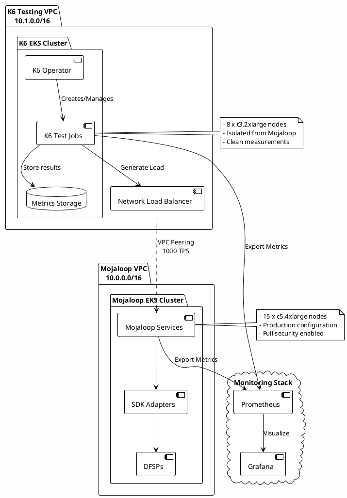
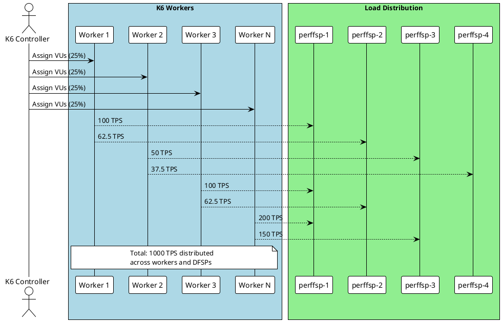

# Diagrams to Copy/Create for K6 Infrastructure

## 1. **k6-testing-architecture.svg**

Create a custom diagram showing the K6 testing infrastructure:

## 2. **k6-worker-distribution.svg**

Create a diagram showing how K6 workers distribute load:

