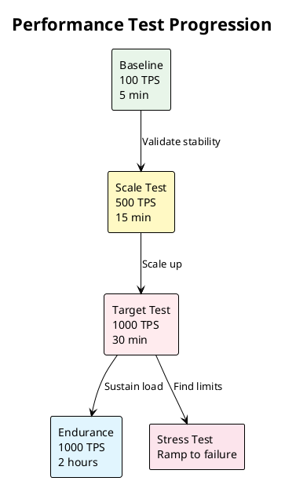

# Phase 07: Performance Testing

> **Purpose**: Execute the full performance test suite to achieve and validate 1000 TPS
> 
> **Time Required**: 4-6 hours
> 
> **Outcome**: Comprehensive performance data proving Mojaloop can handle 1000 TPS with 8 DFSPs

## 🎯 Test Strategy



## 📋 Pre-test Preparation

```bash
# Complete system check
./pre-test-check.sh

# Expected output:
System Ready Check
==================
✅ First test completed successfully
✅ All services healthy (30 min uptime)
✅ Resource utilization < 20%
✅ No pending alerts
✅ Sufficient cluster capacity
✅ Test data provisioned

Estimated test duration: 4.5 hours
Estimated cost: $185
```

### Reset Test Data

```bash
# Reset DFSP positions to initial state
./reset-test-data.sh

# Verify positions
./check-dfsp-positions.sh

# Output:
DFSP Positions
==============
perffsp-1: $1,000,000.00
perffsp-2: $1,000,000.00
perffsp-3: $1,000,000.00
perffsp-4: $1,000,000.00
perffsp-5: $0.00
perffsp-6: $0.00
perffsp-7: $0.00
perffsp-8: $0.00
```

## 🚀 Execute Test Suite

### Option 1: Automated Full Suite

```bash
# Run complete test suite with automatic progression
./run-full-suite.sh

# Monitor in another terminal
./monitor-suite-progress.sh
```

### Option 2: Manual Test Execution

<details>
<summary><strong>Test 1: Baseline (100 TPS)</strong></summary>

```bash
# Deploy baseline test
kubectl apply -f tests/01-baseline-100tps.yaml

# Monitor progress
watch -n 5 kubectl logs k6-baseline-test --tail=50

# Expected results:
✓ Transactions: 30,000
✓ Success Rate: 100%
✓ P95 Latency: < 80ms
✓ Duration: 5 minutes

# Save results
./save-results.sh --test baseline-100tps
```

</details>

<details>
<summary><strong>Test 2: Scale Test (500 TPS)</strong></summary>

```bash
# Deploy scale test
kubectl apply -f tests/02-scale-500tps.yaml

# Monitor critical metrics
./watch-metrics.sh --tps 500

# Expected results:
✓ Transactions: 450,000
✓ Success Rate: > 99.5%
✓ P95 Latency: < 150ms
✓ Duration: 15 minutes

# Check for bottlenecks
./analyze-bottlenecks.sh --test scale-500tps
```

</details>

<details>
<summary><strong>Test 3: Target Test (1000 TPS)</strong></summary>

```bash
# THIS IS THE KEY TEST!
# Deploy 1000 TPS test
kubectl apply -f tests/03-target-1000tps.yaml

# Real-time dashboard
./open-performance-dashboard.sh

# Monitor key metrics
watch -n 2 './show-key-metrics.sh'

# Expected results:
✓ Transactions: 1,800,000
✓ Success Rate: > 99.5%
✓ P95 Latency: < 300ms
✓ P99 Latency: < 500ms
✓ Duration: 30 minutes

# Capture detailed metrics
./capture-detailed-metrics.sh --test target-1000tps
```

</details>

<details>
<summary><strong>Test 4: Endurance Test (1000 TPS for 2 hours)</strong></summary>

```bash
# Deploy endurance test
kubectl apply -f tests/04-endurance-1000tps.yaml

# Monitor for degradation
./monitor-endurance.sh

# Check every 30 minutes for:
- Memory leaks
- Performance degradation
- Error rate increases
- Resource exhaustion

# Expected results:
✓ Transactions: 7,200,000
✓ Success Rate: > 99.5% (sustained)
✓ No performance degradation
✓ No memory leaks
```

</details>

<details>
<summary><strong>Test 5: Stress Test (Ramp to Failure)</strong></summary>

```bash
# Deploy stress test (finds breaking point)
kubectl apply -f tests/05-stress-test.yaml

# Monitor closely
./monitor-stress-test.sh

# Test stages:
- 0-10m: Ramp 0 → 1000 TPS
- 10-20m: Ramp 1000 → 2000 TPS
- 20-30m: Ramp 2000 → 5000 TPS
- Continue until failure

# Record:
- Breaking point TPS
- First component to fail
- Error types observed
- Recovery behavior
```

</details>

## 📊 Load Distribution Pattern

The 8 DFSPs use an asymmetric load pattern mimicking real-world usage:

```
Traffic Distribution:
- 40% : perffsp-1 → perffsp-5 (Major corridor)
- 25% : perffsp-2 → perffsp-6 (Secondary corridor)
- 20% : perffsp-3 → perffsp-7 (Regional traffic)
- 15% : perffsp-4 → perffsp-8 (Small traffic)

At 1000 TPS:
- perffsp-1 → perffsp-5: 400 TPS
- perffsp-2 → perffsp-6: 250 TPS
- perffsp-3 → perffsp-7: 200 TPS
- perffsp-4 → perffsp-8: 150 TPS
```

## 📈 Real-time Monitoring

### Grafana Dashboards

```bash
# Open main performance dashboard
./open-dashboard.sh --dashboard performance-overview

# Key dashboards:
1. Performance Overview - TPS, success rate, latency
2. Service Health - Individual service metrics
3. Infrastructure - CPU, memory, network
4. K6 Metrics - Load generation stats
```

### Critical Metrics to Watch

| Metric | Target | Warning | Critical |
|--------|--------|---------|----------|
| TPS Achieved | 1000 | < 950 | < 900 |
| Success Rate | > 99.5% | < 99% | < 95% |
| P95 Latency | < 300ms | > 400ms | > 500ms |
| CPU Usage | < 70% | > 80% | > 90% |
| Memory Usage | < 70% | > 80% | > 90% |
| Error Rate | < 0.5% | > 1% | > 5% |

## 🔍 Live Analysis

During the 1000 TPS test:

```bash
# Terminal 1: Key metrics
watch -n 2 './show-key-metrics.sh'

# Terminal 2: Error monitoring
./watch-errors.sh

# Terminal 3: Resource usage
./watch-resources.sh

# Terminal 4: Service health
./watch-service-health.sh
```

## 🧪 Validation Queries

Run these Prometheus queries during testing:

```promql
# Actual TPS
rate(mojaloop_transfer_success[1m])

# Success rate
rate(mojaloop_transfer_success[1m]) / rate(mojaloop_transfer_total[1m])

# P95 latency
histogram_quantile(0.95, rate(mojaloop_transfer_duration_bucket[1m]))

# Error rate by type
rate(mojaloop_transfer_error[1m]) by (error_type)
```

## 🔧 Common Issues During Testing

<details>
<summary><strong>TPS plateaus below target</strong></summary>

```bash
# Identify bottleneck
./find-bottleneck.sh

# Common causes:
1. Database connection pool exhausted
   Fix: ./scale-db-connections.sh

2. Kafka lag increasing
   Fix: ./scale-kafka-partitions.sh

3. CPU throttling on services
   Fix: ./scale-service-replicas.sh
```

</details>

<details>
<summary><strong>Sudden spike in errors</strong></summary>

```bash
# Analyze error spike
./analyze-errors.sh --last 5m

# Quick remediation:
1. Reduce load temporarily
   kubectl scale deployment k6-workers --replicas=4

2. Check failing service
   ./find-failing-service.sh

3. Restart unhealthy pods
   ./restart-unhealthy-pods.sh
```

</details>

## 📋 Test Results Collection

After each test:

```bash
# Collect comprehensive results
./collect-test-results.sh --test <test-name>

# This captures:
- K6 summary report
- Prometheus metrics export
- Grafana dashboard snapshots
- Service logs (last 30 min)
- Resource utilization data

# Results saved to:
results/<test-name>-<timestamp>/
├── k6-summary.json
├── metrics/
├── dashboards/
├── logs/
└── analysis-report.html
```

### Capturing K6 Raw Results

```bash
# During test execution, K6 outputs to stdout
# Capture raw output:
kubectl logs -f k6-<test-name> > results/k6-raw-output-<test-name>.log

# Export K6 metrics in JSON format
kubectl exec k6-<test-name> -- k6 stats export > results/k6-metrics-<test-name>.json

# Get detailed summary after test completes
kubectl logs k6-<test-name> --tail=200 > results/k6-summary-<test-name>.txt
```

### Taking Grafana Dashboard Screenshots

```bash
# Option 1: Automated screenshots using Grafana API
./capture-grafana-dashboards.sh --test <test-name>

# This captures:
# - Performance Overview dashboard
# - Service Health dashboard  
# - Infrastructure Metrics dashboard
# - K6 Load Testing dashboard

# Option 2: Manual screenshots for specific moments
# 1. Open Grafana dashboard
./open-dashboard.sh --dashboard performance-overview

# 2. Set time range to test duration
# 3. Take screenshots at key moments:
#    - Peak TPS achievement
#    - Steady state performance
#    - Any anomalies or interesting patterns

# Save screenshots with descriptive names:
# - 1000tps-achieved-timestamp.png
# - steady-state-30min.png
# - latency-distribution-peak.png

# Store in: results/<test-name>-<timestamp>/dashboards/
```

### Critical Dashboards to Capture

1. **Performance Overview** (MUST capture)
   - Shows TPS, success rate, latency percentiles
   - Capture at: test start, peak TPS, test end

2. **Service Health** (MUST capture)
   - Individual service metrics during 1000 TPS
   - Focus on: ML-API-Adapter, Central-Ledger, Account-Lookup

3. **Resource Utilization** (MUST capture)
   - CPU, memory, network for all nodes
   - Capture during: peak load and steady state

4. **Error Analysis** (if errors occur)
   - Error rates, types, and distribution
   - Capture when: error rate > 0.5%

## ✅ Success Criteria

### For 1000 TPS Test:
- [ ] Achieved 1000+ TPS for 30 minutes
- [ ] Success rate > 99.5%
- [ ] P95 latency < 300ms
- [ ] P99 latency < 500ms
- [ ] No service failures
- [ ] No memory leaks
- [ ] CPU usage < 80% on all nodes

### Overall Suite:
- [ ] All 5 tests completed
- [ ] Performance scales linearly to 500 TPS
- [ ] 1000 TPS sustained for 2+ hours
- [ ] Breaking point identified (stress test)
- [ ] Clean recovery after stress test

## 🚀 Next Steps

### If 1000 TPS achieved:
```bash
# Generate success report
./generate-success-report.sh

# Package results
./package-results.sh --output mojaloop-1000tps-results.tar.gz

# Proceed to analysis
cd ../08-analysis
```

### If 1000 TPS not achieved:
```bash
# Don't worry - this is normal! Follow the tuning playbook
cat TUNING-PLAYBOOK.md

# Quick bottleneck check
./scripts/analyze-bottleneck.sh --target-tps 1000

# The playbook will guide you through:
# - Infrastructure scaling (back to Phase 02)
# - Mojaloop configuration (back to Phase 04)
# - Iterative tuning process
```

**Important**: Most deployments require 2-3 tuning iterations to reach 1000 TPS. The [TUNING-PLAYBOOK.md](TUNING-PLAYBOOK.md) provides a systematic approach to get there.

Ready to analyze results? → [Phase 08: Analysis & Reporting](../08-analysis/)

---

<details>
<summary><strong>📚 Additional Resources</strong></summary>

- [Test Configuration Details](TEST_CONFIGS.md)
- [Performance Tuning Guide](TUNING_GUIDE.md)
- [Bottleneck Analysis](BOTTLENECK_ANALYSIS.md)
- [Optimization Strategies](OPTIMIZATIONS.md)

</details>