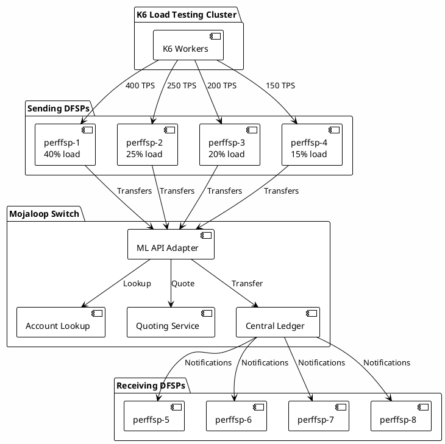

# Diagrams to Copy from Documentation Repository

Copy these diagrams from the documentation repository to this directory:

1. **p2p-transfer-complete-flow.svg**
   - Source: `/documentation/docs/technical/api/assets/diagrams/sequence/figure1.svg`
   - Description: Complete P2P transfer flow (payer-initiated)

2. **8-dfsp-test-architecture.svg**
   - Create custom diagram showing:
     - 8 DFSPs (perffsp-1 through perffsp-8)
     - Load distribution (40%, 25%, 20%, 15%)
     - K6 workers generating load
     - Mojaloop switch in the center

## Custom Diagram Template for 8-DFSP Architecture:

