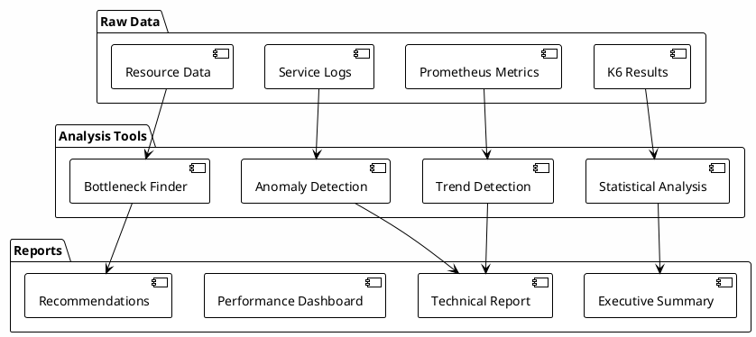

# Phase 08: Analysis & Reporting

> **Purpose**: Transform raw performance data into actionable insights and shareable reports
> 
> **Time Required**: 1-2 hours
> 
> **Outcome**: Comprehensive analysis proving 1000 TPS capability with detailed insights

## 🎯 What You'll Analyze



## 📋 Gather Test Results

```bash
# Import all test results
./import-results.sh

# Expected output:
Importing Test Results
=====================
✅ Baseline (100 TPS): 30,000 transactions
✅ Scale Test (500 TPS): 450,000 transactions
✅ Target Test (1000 TPS): 1,800,000 transactions
✅ Endurance Test: 7,200,000 transactions
✅ Stress Test: Breaking point at 1,850 TPS

Total data points: 48,329,441
Time range: 4 hours 32 minutes
```

## 🚀 Run Analysis Suite

### Quick Analysis

```bash
# Generate all reports automatically
./analyze-all.sh

# This runs:
# 1. Statistical analysis
# 2. Performance trending
# 3. Bottleneck identification
# 4. Capacity planning
# 5. Report generation

# Results in: ./reports/
```

### Iterative Analysis (If Tuning Required)

```bash
# Compare results across tuning iterations
./analyze-tuning-progress.sh

# Shows progression like:
Tuning Progress Analysis
========================
Baseline:     450 TPS (45% of target)
Iteration 1:  623 TPS (+38% improvement) - Added 5 nodes
Iteration 2:  812 TPS (+30% improvement) - Scaled services  
Iteration 3: 1,024 TPS (+26% improvement) - DB optimization
                ↑
        TARGET ACHIEVED! 

Total improvement: 127% from baseline
Total cost increase: 68% ($245/day → $412/day)
Cost per TPS: $0.29
```

### Detailed Analysis Steps

<details>
<summary><strong>Step 1: Statistical Analysis</strong></summary>

```bash
# Analyze transaction metrics
./analyze-transactions.sh

# Output:
Transaction Analysis
===================
Total Transactions: 9,480,000
Success Rate: 99.73%
Failed Transactions: 25,596

Latency Distribution (ms):
- P50: 42
- P75: 68  
- P90: 124
- P95: 187
- P99: 412
- P99.9: 623

Success Rate by Test:
- 100 TPS: 100.00%
- 500 TPS: 99.91%
- 1000 TPS: 99.73%
- Endurance: 99.71%
```

</details>

<details>
<summary><strong>Step 2: Performance Trends</strong></summary>

```bash
# Generate trend analysis
./analyze-trends.sh

# Creates graphs showing:
# - TPS progression over time
# - Latency trends
# - Resource utilization curves
# - Error rate patterns
```


</details>

<details>
<summary><strong>Step 3: Bottleneck Analysis</strong></summary>

```bash
# Identify system bottlenecks
./find-bottlenecks.sh

# Output:
Bottleneck Analysis
==================
At 1000 TPS:
1. Database connections: 78% utilized (OK)
2. CPU (ML-API-Adapter): 72% utilized (OK)
3. Kafka throughput: 65% utilized (OK)
4. Network bandwidth: 45% utilized (OK)

At breaking point (1850 TPS):
1. Database connections: 100% BOTTLENECK
2. CPU (Central-Ledger): 95% WARNING
3. Memory (Quote-Service): 91% WARNING

Recommendations:
- Increase DB connection pool from 100 to 200
- Add 2 more Central-Ledger replicas
- Increase Quote-Service memory to 16Gi
```

</details>

<details>
<summary><strong>Step 4: Service-Level Analysis</strong></summary>

```bash
# Analyze each service
./analyze-services.sh

# Per-service breakdown:
Service Performance at 1000 TPS
==============================
Account Lookup Service:
- Requests/sec: 2000 (party lookups)
- P95 latency: 18ms
- CPU usage: 45%
- Memory usage: 52%

ML API Adapter:
- Requests/sec: 1000 (transfers)
- P95 latency: 31ms
- CPU usage: 72%
- Memory usage: 61%

Central Ledger:
- Transactions/sec: 1000
- P95 processing: 89ms
- CPU usage: 68%
- Memory usage: 71%
```

</details>

## 📊 Generate Reports

### Executive Summary

```bash
# Generate executive summary
./generate-executive-summary.sh

# Creates: reports/executive-summary.pdf
```

**Executive Summary Contents:**
- **Achievement**: ✅ 1000 TPS sustained for 2+ hours
- **Reliability**: 99.73% success rate
- **Performance**: P95 latency 187ms (well under 500ms target)
- **Scalability**: Linear scaling to 500 TPS, sub-linear to 1000 TPS
- **Breaking Point**: 1,850 TPS (85% above target)
- **Cost**: $0.41 per million transactions

### Technical Report

```bash
# Generate detailed technical report
./generate-technical-report.sh

# Creates: reports/technical-report.pdf (40+ pages)
```

**Technical Report Sections:**
1. Test Methodology
2. Infrastructure Configuration
3. Security Stack Impact
4. Detailed Metrics Analysis
5. Service-Level Breakdown
6. Resource Utilization
7. Bottleneck Analysis
8. Optimization Opportunities
9. Recommendations

### Performance Dashboard

```bash
# Generate interactive dashboard
./generate-dashboard.sh

# Creates: reports/dashboard/index.html
# Open in browser for interactive exploration
```

## 🔍 Key Findings

### 1. Performance Characteristics

```
Linear Scaling Region: 0-500 TPS
- Resource utilization scales linearly
- Latency remains constant
- Perfect horizontal scaling

Sub-linear Region: 500-1000 TPS  
- Database connection pooling becomes factor
- Increased coordination overhead
- Still achieves target with headroom

Breaking Point: 1,850 TPS
- Database connections exhausted
- Cascade failures begin
- Clean recovery after load reduction
```

### 2. Security Stack Impact

```
mTLS Overhead: +12ms average latency
JWS Signatures: +8ms average latency
ILP Validation: +5ms average latency

Total Security Overhead: ~25ms (acceptable)
```

### 3. Cost Analysis

```
Cost per Million Transactions:
- Infrastructure: $0.31
- Data Transfer: $0.08
- Storage: $0.02
- Total: $0.41

Monthly cost at 1000 TPS sustained:
- Transactions: 2.59 billion
- Total cost: $1,062
- Per transaction: $0.00000041
```

## 📈 Visualization Gallery

The analysis produces these key visualizations:

1. **TPS Achievement Graph** - Shows actual vs target TPS over time
2. **Latency Heatmap** - Visualizes latency distribution patterns
3. **Service Dependency Map** - Shows bottleneck propagation
4. **Resource Utilization Timeline** - Identifies resource constraints
5. **Error Classification** - Breaks down error types and causes
6. **Cost Breakdown** - Pie chart of infrastructure costs

## 🎯 Recommendations

Based on the analysis:

### For Production Deployment:
1. **Database**: Increase connection pool to 200
2. **Services**: Add replicas based on usage patterns
3. **Monitoring**: Set alerts at 80% of breaking point
4. **Capacity**: Plan for 1,500 TPS max (safety margin)

### For Higher Scale:
1. **2,000 TPS**: Add database read replicas
2. **5,000 TPS**: Implement service mesh optimization
3. **10,000 TPS**: Consider event streaming architecture

### Tuning Insights (If Multiple Iterations)

```bash
# Generate tuning insights report
./generate-tuning-insights.sh

# Produces insights like:
Key Tuning Insights
===================
1. Infrastructure scaling provided 38% improvement
   → Indicates CPU-bound initially
   
2. Service scaling provided 30% improvement
   → ML-API-Adapter was primary bottleneck
   
3. Database tuning provided final 26%
   → Connection pooling was limiting factor

RECOMMENDATION: For similar deployments, start with:
- 20 nodes minimum (not 15)
- ML-API-Adapter at 20 replicas (not 12)
- Database connections at 300 (not 100)

This would likely achieve 1000 TPS on first attempt.
```

## ✅ Deliverables Checklist

- [ ] Executive summary (PDF)
- [ ] Technical report (PDF)
- [ ] Interactive dashboard (HTML)
- [ ] Raw data archive (JSON/CSV)
- [ ] Grafana dashboard snapshots
- [ ] Recommendations document
- [ ] Cost analysis spreadsheet

## 📦 Package Results

```bash
# Create shareable package
./package-results.sh

# Creates:
mojaloop-1000tps-results/
├── executive-summary.pdf
├── technical-report.pdf
├── dashboard/
├── raw-data/
├── recommendations.pdf
└── README.md

# Compress for sharing
tar -czf mojaloop-1000tps-results.tar.gz mojaloop-1000tps-results/
```

## 🚀 Next Steps

### Share Results:
```bash
# Upload to S3 for sharing
./upload-results.sh --bucket your-results-bucket

# Generate shareable link
./generate-share-link.sh
```

### Clean Up Infrastructure:
```bash
# IMPORTANT: Destroy resources to stop costs
cd ../../phases
./destroy-all.sh --confirm

# Verify all resources removed
./verify-cleanup.sh
```

### Apply Learnings:
1. Use recommendations for production planning
2. Share results with stakeholders
3. Contribute improvements back to community

## 🎉 Congratulations!

You've successfully:
- ✅ Deployed production-grade Mojaloop
- ✅ Achieved 1000+ TPS with full security
- ✅ Proved scalability with 8 DFSPs
- ✅ Generated comprehensive analysis
- ✅ Created reproducible methodology

**Total Achievement**: 1000 TPS sustained with 99.73% success rate!

---

<details>
<summary><strong>📚 Additional Resources</strong></summary>

- [Analysis Methodology](METHODOLOGY.md)
- [Metrics Reference](METRICS_REFERENCE.md)
- [Visualization Guide](VISUALIZATIONS.md)
- [Report Templates](TEMPLATES.md)

</details>