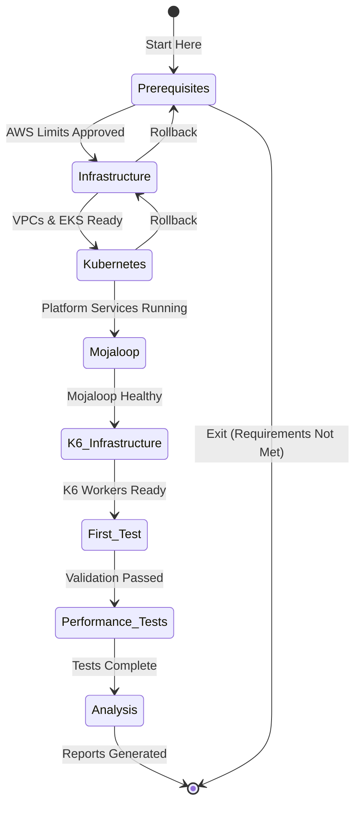

# Performance Testing Phases

> **Story**: Breaking down a complex performance testing setup into manageable, validated phases ensures success and makes the process reproducible.

## 📊 Phase Overview

Each phase is designed to be:
- **Self-contained**: Can be validated independently
- **Resumable**: Save progress and continue later
- **Rollbackable**: Undo changes if something goes wrong
- **Measurable**: Clear success criteria

## 🎯 Phase Progression



## 📁 Phase Structure

Each phase follows the same structure:

```
phases/XX-phase-name/
├── README.md           # What, why, and how
├── deploy.sh          # Main execution script
├── validate.sh        # Verify phase success
├── rollback.sh        # Undo phase changes
├── troubleshoot.sh    # Diagnose issues
├── TROUBLESHOOTING.md # Common problems
├── config/            # Phase configuration
├── scripts/           # Helper scripts
└── tests/             # Validation tests
```

## 🚀 Execution Patterns

### Interactive Mode (Recommended for First Time)
```bash
cd phases/01-prerequisites
./deploy.sh --interactive
```

### Automated Mode (For CI/CD)
```bash
./run-phase.sh 01-prerequisites --auto-approve
```

### Validate Only
```bash
cd phases/02-infrastructure
./validate.sh
```

## 📊 Progress Tracking

Your progress is automatically saved:

```bash
# Check overall progress
./show-progress.sh

# Output:
Phase Status Overview
====================
✅ 01-prerequisites    [Completed: 2024-01-15 10:30]
✅ 02-infrastructure   [Completed: 2024-01-15 13:45]
🔄 03-kubernetes       [In Progress: 45% - Deploying platform services]
⏹️  04-mojaloop        [Not Started]
⏹️  05-k6-infrastructure [Not Started]
⏹️  06-first-test      [Not Started]
⏹️  07-performance-tests [Not Started]
⏹️  08-analysis         [Not Started]

Time Elapsed: 4h 23m
Estimated Remaining: 6h 30m
```

## 🔄 Recovery Scenarios

### Resume After Interruption
```bash
# Automatically continues from last successful step
./resume-deployment.sh
```

### Rollback a Phase
```bash
# Rollback specific phase
cd phases/03-kubernetes
./rollback.sh

# Or rollback everything
./rollback-all.sh --confirm
```

### Skip a Phase
```bash
# If you have existing infrastructure
./run-phase.sh 02-infrastructure --skip
```

## 📋 Phase Details

| Phase | Duration | Dependencies | Validates |
|-------|----------|--------------|-----------|
| [01-prerequisites](01-prerequisites/) | 30 min | None | Tools, Access, Limits |
| [02-infrastructure](02-infrastructure/) | 2-3 hrs | Prerequisites | VPCs, EKS, RDS |
| [03-kubernetes](03-kubernetes/) | 1-2 hrs | Infrastructure | Platform Services |
| [04-mojaloop](04-mojaloop/) | 2-3 hrs | Kubernetes | 8 DFSPs, Security |
| [05-k6-infrastructure](05-k6-infrastructure/) | 1-2 hrs | Infrastructure | Isolated K6 Cluster |
| [06-first-test](06-first-test/) | 30 min | Mojaloop + K6 | Basic Connectivity |
| [07-performance-tests](07-performance-tests/) | 4-6 hrs | First Test | 1000 TPS Achievement |
| [08-analysis](08-analysis/) | 1-2 hrs | Test Results | Reports & Insights |

## 🎯 Success Criteria

Each phase has specific success criteria that must be met:

### Quick Validation
```bash
# From project root
./validate-all-phases.sh

# Shows:
✅ Prerequisites: All tools installed
✅ Infrastructure: 2 EKS clusters running
✅ Kubernetes: 15/15 platform services healthy
⏸️  Mojaloop: Not deployed yet
```

### Detailed Validation
```bash
# For specific phase
cd phases/02-infrastructure
./validate.sh --detailed
```

## 💡 Best Practices

1. **Always Validate Before Proceeding**
   ```bash
   ./validate.sh && ../next-phase/deploy.sh
   ```

2. **Use Phase Scripts, Not Direct Commands**
   - Scripts handle errors, logging, and state
   - Direct commands may leave inconsistent state

3. **Monitor Progress in Another Terminal**
   ```bash
   # Terminal 2
   watch -n 5 ./show-progress.sh
   ```

4. **Save Logs for Troubleshooting**
   ```bash
   ./deploy.sh 2>&1 | tee deploy-$(date +%Y%m%d-%H%M%S).log
   ```

## 🚨 Emergency Procedures

### Full Stop
```bash
# Stops all active deployments
./emergency-stop.sh
```

### Cost Control
```bash
# Shut down expensive resources but maintain state
./cost-saving-mode.sh --retain-data
```

### Support Bundle
```bash
# Collect all logs and state for debugging
./create-support-bundle.sh
# Creates: support-bundle-20240115-1430.tar.gz
```

---

Ready to begin? Start with [Phase 01: Prerequisites](01-prerequisites/) →